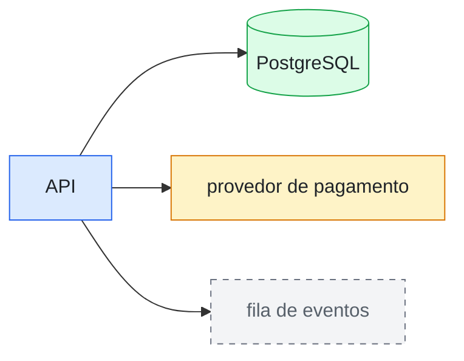
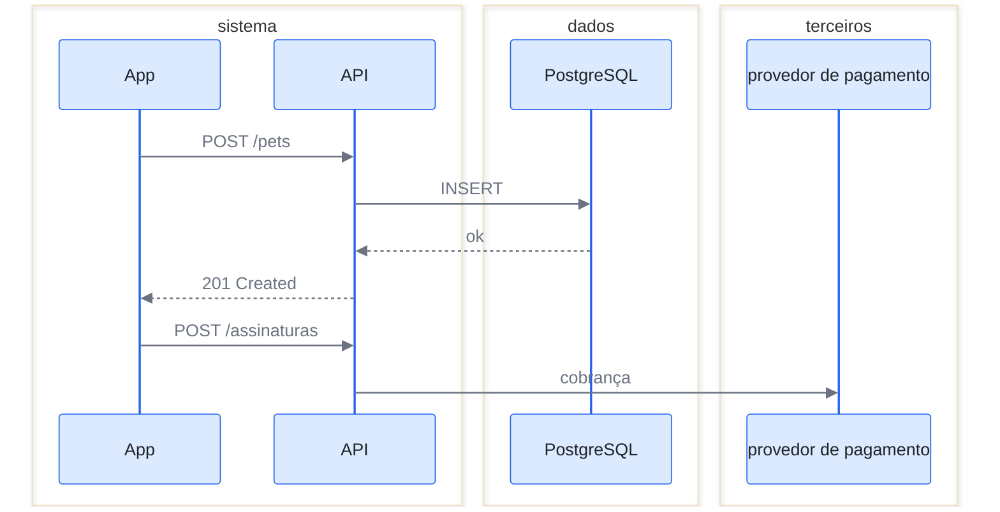
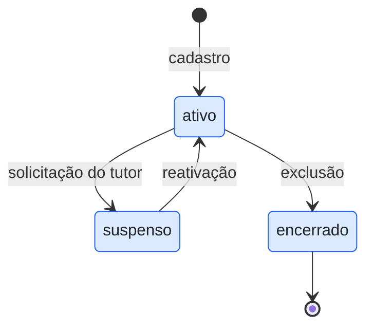
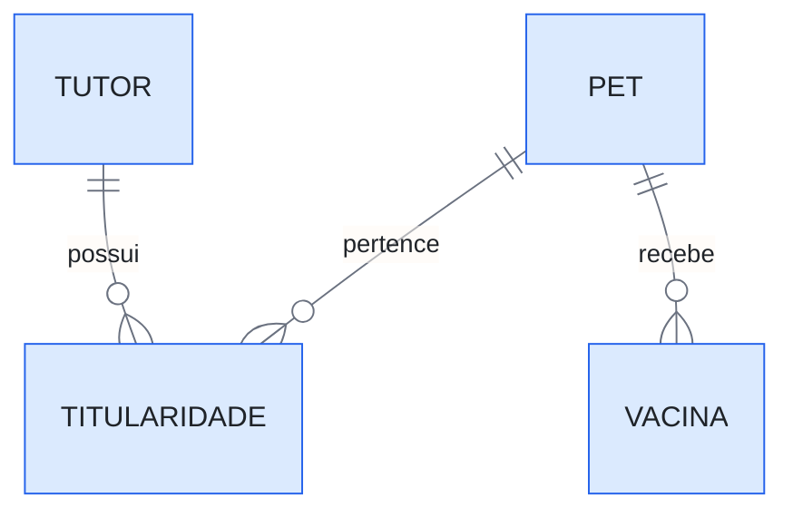
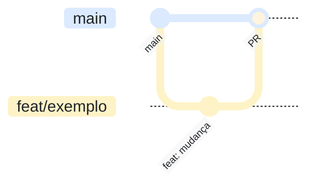

# Diagrama-0000: Título curto do que o diagrama mostra

Um parágrafo de contexto: o que este diagrama representa, e o que ele ajuda a
entender que o texto sozinho não mostra bem.

Documentos que usam este diagrama: links para as ADRs e spikes que apontam para cá.

---

## Identidade visual

Quatro papéis, quatro cores — o significado é fixo em todos os diagramas:

| Papel | Cor | Significado |
|---|---|---|
| `principal` | azul `#dbeafe` / borda `#2563eb` | componente do sistema, caminho principal |
| `externo` | âmbar `#fef3c7` / borda `#d97706` | serviço de terceiro — provedor, API externa |
| `dado` | verde `#dcfce7` / borda `#16a34a` | armazenamento — banco, fila, arquivo |
| `futuro` | cinza `#f3f4f6` / borda `#6b7280`, tracejado | decidido mas ainda não existente — some quando entregue |

Cada tipo de diagrama aplica a identidade pelo mecanismo que o Mermaid oferece,
demonstrado nos modelos abaixo: **flowchart** e **estados** usam as classes
`classDef` (que preservam a forma e o espaçamento nativos); **sequência** estiliza
os atores pela diretiva `init` e agrupa papéis em `box transparent`;
**entidade-relacionamento** recebe o tom azul via `init`; **git** colore as
branches pelas variáveis `git0..git2`. Atenção ao detalhe que morde: `themeVariables`
só têm efeito com `'theme': 'base'` declarado na diretiva.

## Modelos de referência

### Fluxo (flowchart)

Quando usar: caminhos, pipelines, dependências entre componentes.

### Sequência (sequenceDiagram)

Quando usar: a ordem de chamadas entre partes ao longo do tempo — quem fala com
quem, e o que volta. Os `box` agrupam participantes pelo papel da identidade.

### Estados (stateDiagram-v2)

Quando usar: ciclo de vida de uma entidade — os estados possíveis e o que dispara
cada transição.

### Entidade-relacionamento (erDiagram)

Quando usar: o modelo de dados de um módulo — tabelas, chaves e cardinalidades.

### Git (gitGraph)

Quando usar: fluxos de branch e merge. A `main` leva o azul da identidade; as
branches curtas alternam âmbar e verde.

