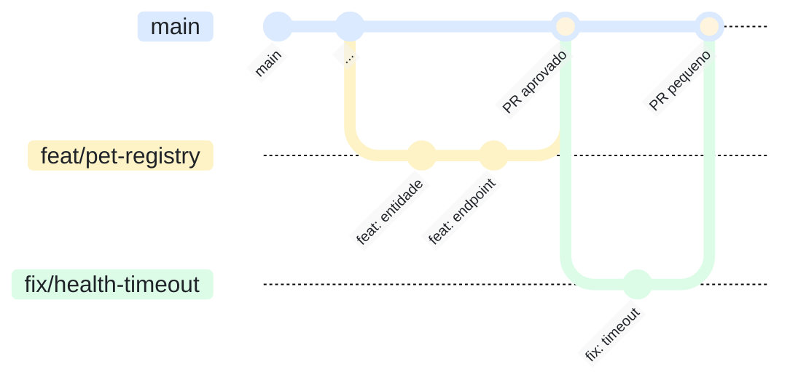

# Diagrama-0001: Fluxo de branches

O GitHub Flow praticado no repositório: branch curta nasce da `main`, recebe
commits de um assunto só, volta por pull request e é apagada depois do merge. A
`main` nunca recebe commit direto.

Documentos que usam este diagrama: [ADR-0007](../adrs/0007-fluxo-de-entrega.md).
