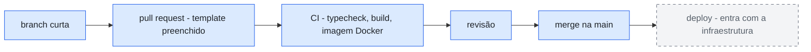

# Diagrama-0002: Caminho de um PR até a main

O trajeto de toda mudança: da branch curta ao merge, com o CI como portão — não
como aviso. O estágio de deploy aparece tracejado porque está decidido mas ainda
não existe: entra no PR que provisionar a infraestrutura
([ADR-0007](../adrs/0007-fluxo-de-entrega.md)).

Documentos que usam este diagrama: [ADR-0007](../adrs/0007-fluxo-de-entrega.md).
