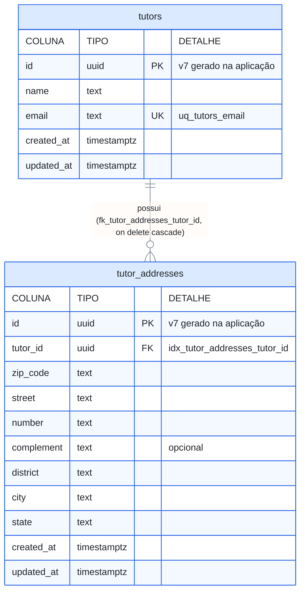

# Diagrama-0003: Modelo de dados do módulo identity

As duas primeiras tabelas do sistema e o primeiro relacionamento 1:N — o molde
de chave primária e estrangeira que as próximas tabelas copiam: `id` uuid v7
gerado na aplicação, constraints nomeadas, `created_at`/`updated_at` em toda
tabela e FK com índice próprio.

Documentos que usam este diagrama:
[ADR-0010](../adrs/0010-tabelas-de-tutor-e-endereco.md).

As tabelas de `pet-registry` (`pets` e a titularidade `tutors_pets`, N:N desde
o primeiro dia) entram neste desenho quando a Spec-002 as definir — o mapa
completo da fase está no
[Spike-0005](../spikes/0005-modelagem-de-dados-da-fase-1.md).
