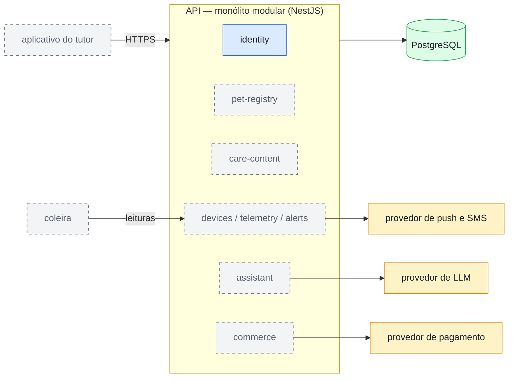

# Diagrama-0004: Visão macro do sistema

O sistema inteiro em uma tela, com o estado honesto de cada peça: o que existe
hoje (azul e verde), o que é serviço de terceiro (âmbar) e o que está decidido
mas ainda não construído (cinza tracejado — ganha cor cheia quando entregue).
A fase em que cada peça tracejada entra está no
[Diagrama-0005](0005-fases-de-entrega.md).

Documentos que usam este diagrama:
[ADR-0002](../adrs/0002-monolito-modular-com-entrega-faseada.md).

Leitura rápida: hoje o sistema é a API com o módulo `identity` de pé sobre o
PostgreSQL. O aplicativo consome a API por HTTPS; a coleira, quando chegar,
alimenta a ingestão de telemetria; e cada integração externa entra por porta e
adapter, nunca direto na regra de negócio
([Guia-0002](../guides/0002-padroes-de-projeto.md)).
