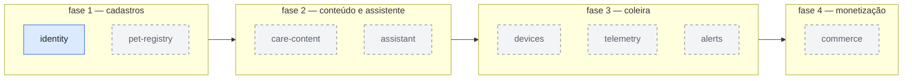

# Diagrama-0005: Fases de entrega

As quatro fases do produto e os módulos que cada uma liga — sem reescrever os
anteriores, que é a promessa central da
[ADR-0002](../adrs/0002-monolito-modular-com-entrega-faseada.md). Uma fase só
começa quando a anterior sustenta uso real; o mapa de módulos vem do
[Spike-0002](../spikes/0002-organizacao-interna-dos-modulos.md).

Documentos que usam este diagrama:
[ADR-0002](../adrs/0002-monolito-modular-com-entrega-faseada.md).

O azul marca o que já está entregue: o `identity` completo — migration,
domínio, borda HTTP e testes ([Spec-0001](../../.spec/0001-cadastro-de-tutor/spec.md)).
Cada módulo que fica azul carrega junto suas decisões registradas: é assim que
o diagrama envelhece sem mentir.
